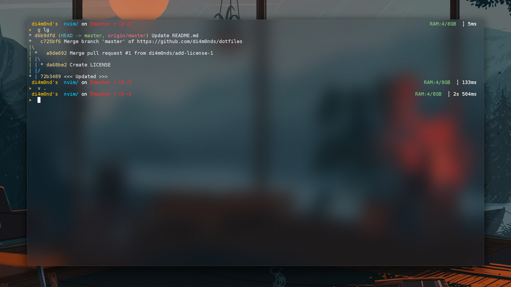
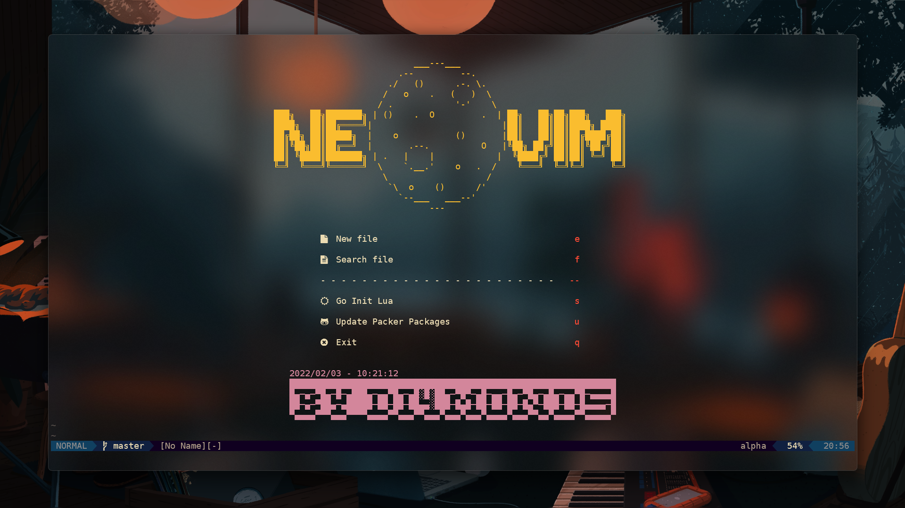

<!-- Preview -->

| :exclamation:  Announcement   |
| :---------------------------------------|
|Hey, got another Neovim flavor for you — new mappings, slick plugins, and a vibe that’s just different. Wanna give it a spin?
|Check it out: [di4m0nds/nvim.lua](https://github.com/di4m0nds/nvim.lua)

<!-- Title -->
<h2 align="center">
My Windows Terminal and Oh-My-Posh Configuration
</h2>

## Links
> [Windows Terminal](https://www.microsoft.com/store/productId/9MZ1SNWT0N5D)

> [Oh-My-Posh](https://ohmyposh.dev/)

> [I also used Scoop as Package Manager](https://scoop.sh/)

<!-- Title -->
<h2 align="center">
My Neovim >=0.5.0 Config with Lua Engine
</h2>

#### Neovim Preview

#### Neovim Dashboard Preview

<!-- Plugins -->
## Plugins / Packages Neovim (Lua)
> [Tresitter](https://github.com/di4m0nds/dotfiles/blob/master/_neovim-config-lua/lua/autoload/nvim-treesitter-config/init.lua)

> [LSP (Language Server Protocol)](https://github.com/di4m0nds/dotfiles/blob/master/_neovim-config-lua/lua/autoload/nvim-lsp-config/init.lua)

> [Nvim Tree](https://github.com/di4m0nds/dotfiles/blob/master/_neovim-config-lua/lua/autoload/nvim-tree-config/init.lua)

> [Lualine Status Bar](https://github.com/di4m0nds/dotfiles/blob/master/_neovim-config-lua/lua/autoload/nvim-lualine-config/init.lua)

> [CMP Autocomplete](https://github.com/di4m0nds/dotfiles/blob/master/_neovim-config-lua/lua/autoload/nvim-cmp-config/init.lua)

> [Alpha Dashboard](https://github.com/di4m0nds/dotfiles/blob/master/_neovim-config-lua/lua/autoload/nvim-alpha-config/init.lua)

> [Indent Blankline](https://github.com/di4m0nds/dotfiles/blob/master/_neovim-config-lua/lua/autoload/indent-blankline-config/init.lua)

> [Telescope](https://github.com/di4m0nds/dotfiles/blob/master/_neovim-config-lua/lua/autoload/nvim-telescope-config/init.lua)

> [Discord Presence](https://github.com/di4m0nds/dotfiles/blob/master/_neovim-config-lua/lua/autoload/discord-presence-config/init.lua)

> [Mardown Preview](https://github.com/di4m0nds/dotfiles/blob/master/_neovim-config-lua/lua/autoload/markdown-preview-config/init.lua)

<!-- LICENSE -->

<h2 align="center">
LICENSE
</h2>

> [GPL-3.0 License](https://github.com/di4m0nds/dotfiles/blob/master/LICENSE)
