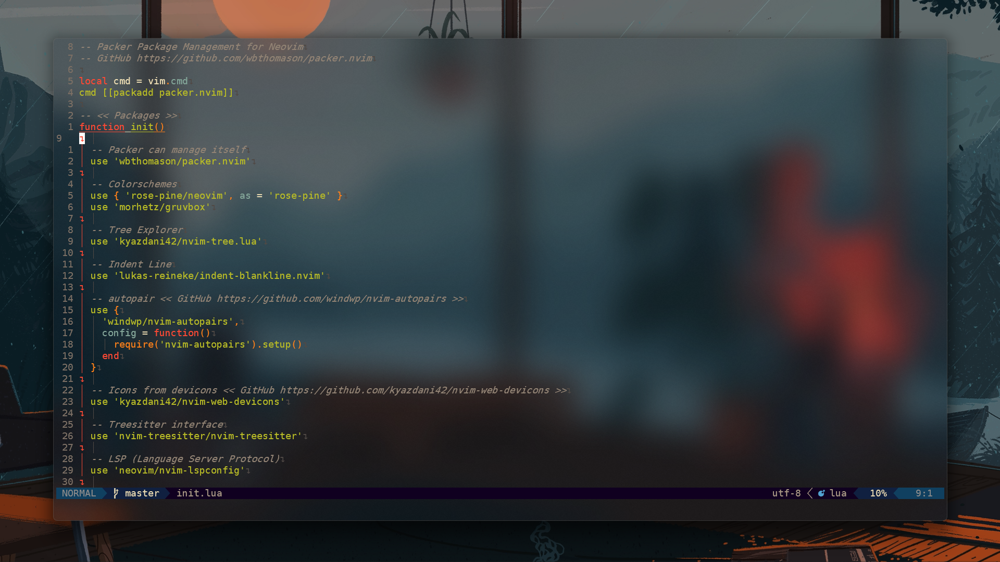

<!-- Preview -->
<!-- Title -->
<h2 align="center">
My Neovim >=0.5.0 Config with Lua Engine
</h2>

<p align="center">

</p>

<!-- Plugins -->
## Plugins / Packages
> [Tresitter](https://github.com/di4m0nds/nvim-lua/tree/master/lua/autoload/nvim-treesitter-config/init.lua)

> [LSP (Language Server Protocol)](https://github.com/di4m0nds/nvim-lua/tree/master/lua/autoload/nvim-lsp-config/init.lua)

> [Nvim Tree](https://github.com/di4m0nds/nvim-lua/tree/master/lua/autoload/nvim-tree-config/init.lua)

> [Lualine Status Bar](https://github.com/di4m0nds/nvim-lua/tree/master/lua/autoload/nvim-lualine-config/init.lua)

> [CMP Autocomplete](https://github.com/di4m0nds/nvim-lua/tree/master/lua/autoload/nvim-cmp-config/init.lua)

> [Alpha Dashboard](https://github.com/di4m0nds/nvim-lua/tree/master/lua/autoload/nvim-alpha-config/init.lua)

> [Indent Blankline](https://github.com/di4m0nds/nvim-lua/tree/master/lua/autoload/indent-blankline-config/init.lua)

> [Telescope](https://github.com/di4m0nds/nvim-lua/tree/master/lua/autoload/nvim-telescope-config/init.lua)

<!-- Structure -->
## Main Structure
My folder structure in `~/.config/nvim` (in *nix system) || `~/AppData/Local/nvim` (in Windows system)
```text
📂lua
│ 📂autoload
│ │ 📂discord-presence-config
│ │ └ 🌑init.lua
│ │ 📂indent-blankline-config
│ │ └ 🌑init.lua
│ │ 📂nvim-alpha-config
│ │ └ 🌑init.lua
│ │ 📂nvim-cmp-config
│ │ └ 🌑init.lua
│ │ 📂nvim-lsp-config
│ │ └ 🌑init.lua
│ │ 📂nvim-lualine-config
│ │ └ 🌑init.lua
│ │ 📂nvim-telescope-config
│ │ └ 🌑init.lua
│ │ 📂nvim-tree-config
│ │ └ 🌑init.lua
│ └ 📂nvim-treesitter-config
│   └ 🌑init.lua
│ 📂plugs
│ 🌑keymaps.lua
│ 🌑settings.lua
└ 🌑theme.lua
📂plugin
└ 🌑packer_compiled.lua
🌑init.lua
```

<!-- Preview -->
## Preview

